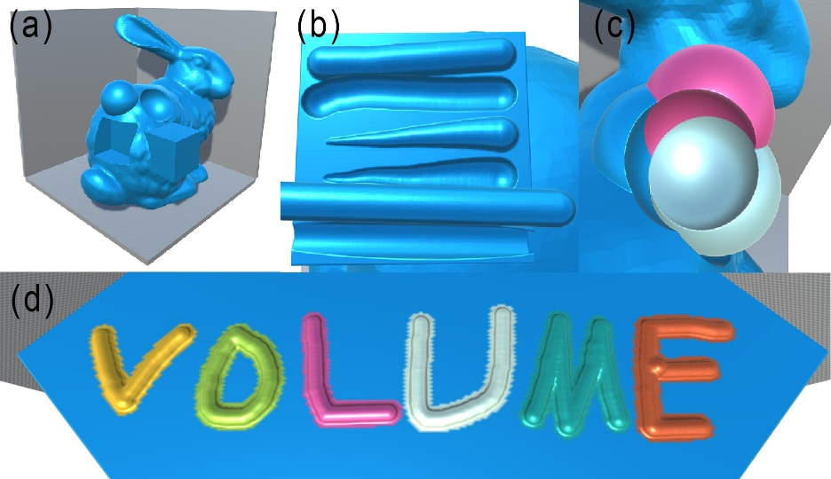
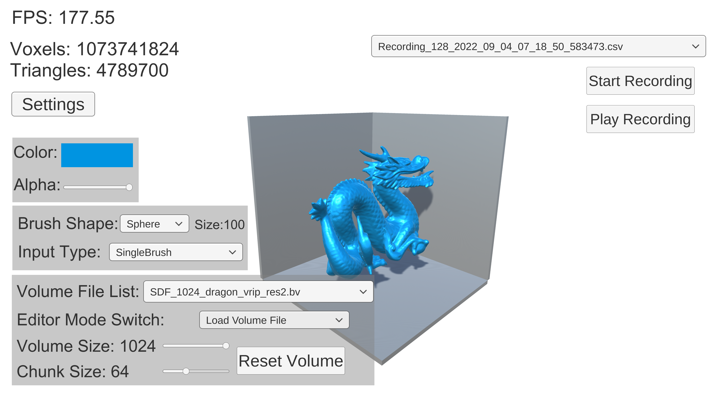
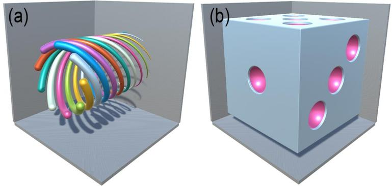

# Large Volume Data Interaction Framework

### [Video](https://youtu.be/0G11HCm5MvA) | [Paper[Link TBA]](https://arxiv.org/abs/TBA)

Large Volume Data Interaction Framework (LVDIF) is an open-source interaction framework for real-time interact with large volume data. It is integrated into Unity3D to benefit from interaction scenarios in game engine. LVDIF contains 2 main components: a CUDA library that provides volume data container, mesh to SDF algorithm, and volume rendering pipeline; an interaction framework that provides input device interaction and volume interaction interface in Unity3D.

## Features

- A robust and efficient approach for the sign calculation of large SDF volume generation from triangle mesh.
- A GPU-based strategy for optimization of interactive 10243 RGBA SDF volume.
- Cross-device input support (mouse, VR controller, etc.)
- Scripting language for procedural modelling.

LVDIF supports interactive editing of large volume data with cross-device input support. This figure shows some interactive editing examples using a mouse-based brush on a 10243 RGBA SDF volume of the Stanford bunny. (a) basic union and subtraction operations of the 2003 cube and sphere primitives; (b) brush input with a radius of 15 for painting and erasing using a mouse: (from top to bottom): basic brush, dynamic brush, and drill brush; (c) subtraction on a union of three 2003 sphere primitives with different colors; and (d) a painting brush example in a radius of 3 on a 2003 cube primitive.

## Installation & Set-up

System requirement: Windows

Unity3D: 2020.1 and above (The sample project is built in 2021.2.3f1)

The DLL project is built in Visual Studio 2019. The Unity project contains the prebuilt DLL.

1. Install NVIDIA CUDA toolkit 11.0 or above.
2. Import the Unity package or open the project file.
3.  Enable "Allow 'unsafe' code" (for Native Array) in Unity Player Settings.
4. Click the set up button in editor window: Tools -> LVDIF -> Set up.

## Getting Started Guide

The example scenes are in Examples folder (also see this [video](https://youtu.be/0G11HCm5MvA)).

### Mouse&Keyboard 

Scene: Mouse example.unity

This scene contains the main functions of LVDIF.

Instruction: UI on/off: Esc; Camera movement: WASD and right mouse button; Switch color: Q and E. 

Input (Load or generate a volume before input): left mouse button; Eraser on/off: middle mouse button; Change Brush size: mouse wheel.

Mesh to SDF for 10243 volume requires about 8 GB GPU memory.

### Optional set-up for VR

Scene: Oculus rift s VR example.unity

Click the set up VR button in editor window: Tools -> LVDIF -> Set up VR

The VR example needs the Oculus Integration from Unity Asset Store.

The VR input is defined in OculusVRInput.cs:

Oculus VR input instruction: Switch color: left controller thumb stick. Switch input method: left controller X and Y. Move the pen: right controller trigger.

Input (Load or generate a volume before input): left controller trigger; Eraser on/off: click left controller thumb stick; Change Brush size: right controller thumb stick.

Integrate with other input device: see AbstractInputDevice.cs.

### Procedural modelling

Load a volume file then press F7 to F8. The example scene contains 2 procedural modelling simple: (a): colorful 3D spiral lines; (b) a dice.

### Input Action Record and Replay

Record: Press start/stop recording; Replay: Press play recording.

## To do list
1. Add Compute shader as alternative backend of rendering pipeline to support more GPU device. It is possible to replace the CUDA kernel and single large GPU buffer for large volume data with Compute shader and a group of smaller 3D textures. 
2. Smooth color rendering.
3. Change the input recording file to JSON.
4. Implement ray marching and other volume rendering algorithms. 
5. API document and Wiki.
6. CMake build script for the DLL.
7. Add support for other game engine such as Unreal.

## Contributions
We welcome community contributions to this repository.

## Thanks
Many thanks to the authors of these open-source repositories:
1. [Distance functions for basic primitives](https://iquilezles.org/articles/distfunctions/)
2. [Unity Marching Cubes](https://github.com/SebLague/Marching-Cubes)

## Citations
Link to [arXiv Paper [TBA]](https://arxiv.org/abs/TBA)
Contact: chaosikaros@outlook.com